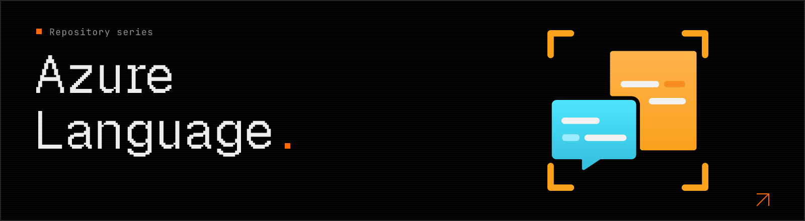

# Azure Language Centre



Practical Python recipes for Azure AI Language, demonstrating the
`azure-ai-textanalytics` SDK in a [Jupyter notebook](./notebook.ipynb) with realistic
examples and detailed result output.

> [!WARNING]
> **Deprecated features and pinned API version**
>
> The [notebook](./notebook.ipynb) explicitly targets Azure Language API
> **`2023-04-01`** (`api_version="2023-04-01"`), not the latest API version.
> Several features demonstrated here are scheduled for retirement:
>
> - [Entity linking](https://learn.microsoft.com/en-us/azure/ai-services/language-service/entity-linking/overview)
>   retires on **September 1, 2028**.
> - [Sentiment analysis and opinion mining](https://learn.microsoft.com/en-us/azure/ai-services/language-service/sentiment-opinion-mining/overview),
>   [key phrase extraction](https://learn.microsoft.com/en-us/azure/ai-services/language-service/key-phrase-extraction/overview),
>   [custom text classification](https://learn.microsoft.com/en-us/azure/ai-services/language-service/custom-text-classification/overview),
>   and [summarization](https://learn.microsoft.com/en-us/azure/ai-services/language-service/summarization/overview)
>   (extractive and abstractive) retire on **March 31, 2029**.
>
> Pinning an API version does not extend these services' lifetimes. Treat the
> affected recipes as legacy examples and follow Microsoft's
> [migration guidance](https://techcommunity.microsoft.com/blog/azure-ai-foundry-blog/transitioning-from-azure-language-features-to-foundry-models/4524092)
> for new projects and production workloads.

## How to deploy

You need an Azure subscription, the [Azure Developer CLI (`azd`)](https://learn.microsoft.com/en-us/azure/developer/azure-developer-cli/install-azd),
and permission to create resource groups and Azure Language resources and retrieve
their keys (for example, the Contributor role on the subscription).
The commands below use Bash on macOS, Linux, or Windows with WSL.

The [Bicep template](./infra/main.bicep) creates a resource group and an Azure
Language (`TextAnalytics`) resource on the Standard (`S`) tier, with a public
endpoint and API-key authentication. API calls can incur charges; use the
calculator in [Useful links](#useful-links) to estimate costs.

The included [azd project configuration](./azure.yaml) and
[Bicep parameter file](./infra/main.parameters.json) let you deploy with `azd up`.
This is an infrastructure-only deployment; the notebook runs locally.

1. Clone the repository and open its root directory, if you have not already:

   ```bash
   git clone https://github.com/NicoGrassetto/Azure-Language-Centre.git
   cd Azure-Language-Centre
   ```

2. Sign in with `azd` and create a named environment:

   ```bash
   azd auth login
   azd env new dev
   ```

3. Provision the Azure resources:

   ```bash
   azd up
   ```

   Select your Azure subscription and region when prompted.
   The template accepts `swedencentral`, `eastus`, `westeurope`, or `northeurope`.
   Check that your chosen region supports the features you want to run and has
   available capacity. `azd` passes the environment name and location into the
   subscription-scoped Bicep deployment.

   Once deployment succeeds, `azd` saves the resource group, Language account
   name, and endpoint in the selected environment under `.azure/`, which is
   ignored by Git. The API key is retrieved separately in the next section; it
   is not exposed as a deployment output.

To deploy changes later, select the same environment with `azd env select dev`
and run `azd up` again. Keep the environment name, subscription, and region
unchanged to reuse the same resource names.

## How to run

Install a recent Python 3 version with `venv` and `pip`, plus the
[Azure CLI](https://learn.microsoft.com/en-us/cli/azure/install-azure-cli) to retrieve
the resource's API key, and complete the deployment above. Run these commands
locally from the repository root.

1. Create and activate a virtual environment:

   ```bash
   python3 -m venv .venv
   source .venv/bin/activate
   ```

   In a new terminal, run the activation command again; you do not need to
   recreate the environment.

2. Install the notebook dependencies and register a kernel inside the virtual
   environment:

   ```bash
   python -m pip install --upgrade pip
   python -m pip install "azure-ai-textanalytics>=5.3,<6" jupyterlab ipykernel
   python -m ipykernel install --sys-prefix \
     --name azure-language-centre \
     --display-name "Azure Language Centre (.venv)"
   ```

   The SDK is kept on the 5.x line because the notebook uses `TextAnalyticsClient`
   with service API version `2023-04-01`.

3. Select your `azd` environment and load the endpoint and API key into the
   current terminal's environment. Replace `dev` if you chose a different
   environment name. The Azure CLI authenticates separately from `azd`; select
   the subscription stored in the `azd` environment before retrieving the key:

   ```bash
   azd env select dev
   az login
   az account set --subscription "$(azd env get-value AZURE_SUBSCRIPTION_ID)"

   AZURE_RESOURCE_GROUP="$(azd env get-value AZURE_RESOURCE_GROUP)"
   AZURE_LANGUAGE_NAME="$(azd env get-value AZURE_LANGUAGE_NAME)"
   AZURE_LANGUAGE_ENDPOINT="$(azd env get-value AZURE_LANGUAGE_ENDPOINT)"
   AZURE_LANGUAGE_KEY="$(az cognitiveservices account keys list \
     --resource-group "$AZURE_RESOURCE_GROUP" \
     --name "$AZURE_LANGUAGE_NAME" \
     --query key1 --output tsv)"

   export AZURE_LANGUAGE_ENDPOINT AZURE_LANGUAGE_KEY
   ```

   These variables must be present in the notebook kernel's environment. The
   notebook does not load a `.env` file automatically. Do not paste API keys into
   notebook cells, print them, or commit them to source control.

4. Start JupyterLab from this same activated terminal:

   ```bash
   jupyter lab notebook.ipynb
   ```

   Open [notebook.ipynb](./notebook.ipynb), select the
   **Azure Language Centre (.venv)** kernel, and run **Creating the client** first.
   Then run the recipes you want to try, one cell at a time.

   The custom single-label/multi-label classification and custom entity
   recognition recipes require separately trained and deployed Language
   projects. Replace `<your-project-name>` and `<your-deployment-name>` in those
   cells, or skip them. The Bicep template does not create those projects, models,
   or their training storage, so do not use **Run All** on the unchanged notebook.
   Run **Closing the client** last; rerun the client setup cell before trying
   more recipes afterward.

   Alternatively, use VS Code with its Python and Jupyter extensions. Start
   VS Code from the configured terminal with `code .` and select the `.venv`
   interpreter through **Select Kernel**. If VS Code was already running, fully
   restart it from that terminal so it inherits the exported variables.

5. When finished, stop JupyterLab with `Ctrl+C` and confirm shutdown if prompted,
   then clear the credentials and deactivate the environment:

   ```bash
   unset AZURE_LANGUAGE_ENDPOINT AZURE_LANGUAGE_KEY
   deactivate
   ```

## Useful links

- [Azure Language documentation on Microsoft Learn](https://learn.microsoft.com/en-us/azure/ai-services/language-service/overview)
- [Azure Language Text Analysis REST API reference, version 2023-04-01](https://learn.microsoft.com/en-us/rest/api/language/analyze-text/operation-groups?view=rest-language-analyze-text-2023-04-01&preserve-view=true)
- [Azure pricing calculator for Azure Language](https://azure.microsoft.com/en-us/pricing/calculator/?service=cognitive-services) - select Language and configure the region, features, and expected usage.

## License

This project is licensed under the [MIT License](./LICENSE).
